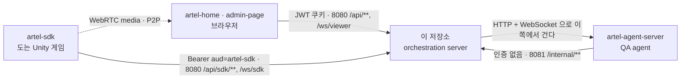

# artel-orchestration-server

ARTEL 은 QA agent 가 게임을 직접 플레이해 테스트하는 제품이고, 이 서버는 그 가운데에 선 orchestration 임.
브라우저 앱(artel-home, admin-page)이 프로젝트와 시나리오를 만들고, Unity 빌드에 붙은 artel-sdk 가 게임을
조작하고 관측하며, artel-agent-server 의 LLM agent 가 무엇을 할지 정함. 셋 중 어느 둘도 서로 직접 말하지
않고 전부 이 서버를 거침.

- Kotlin · Spring WebFlux · 코루틴 서버. 포트 둘, 인바운드 WebSocket 둘, 아웃바운드 WebSocket 둘
- 도메인 패키지 18 개의 vertical slice. 각 패키지가 자기 controller·service·repository 를 소유함
- 공유하라고 만든 자리는 `common/` 과 `config/` 둘. 다만 `auth` 도 사실상 그 자리임 —
  세션과 JWT 를 다루는 기본 코드를 바깥 48 개 파일이 가져다 씀



- **media 는 이 서버를 지나지 않음** — screen 스트리밍은 SDK 와 브라우저 사이 P2P 이고 이 서버는 signalling 만 중계함
- agent-server 와의 방향이 반대임 — agent-server 는 `/internal/**` 을 부르러 오고, QA 런과 시나리오 생성은
  이 서버가 agent-server 에 먼저 걺
- 더 자세한 것은 [`docs/architecture.md`](docs/architecture.md)

## 도메인 지도

| 패키지 | 무엇을 소유하나 |
| --- | --- |
| `auth` | GitHub OAuth 로그인, JWT 발급·재발급, SDK loopback 로그인 code, CLI token |
| `project` | 프로젝트와 멤버, 초대, 기획서 문서 버전 |
| `game` | `game_instance` 와 `game_build`. SDK 가 실행마다 부르는 등록 지점 |
| `sdk` | `/ws/sdk` 세션과 메시지 분기 |
| `sdkperf` | SDK 가 보고하는 프레임 지표와 그 보존 주기 |
| `stream` | `/ws/viewer`, WebRTC signalling, lease |
| `contentmap` | 게임 빌드의 지도 — `scene`, `capability`, `capability_evidence` |
| `scenecontext` | agent 가 지금 화면에 대해 읽는 문맥. `/internal` 전용 |
| `testcase` | test case 와 명세, pgvector 검색 |
| `testscenario` | 시나리오 생성 대화와 reconcile |
| `testrun` | test run 과 그 안의 시나리오 배치 |
| `qa` | QA 런 실행 — `qa_run`, `qa_try`, screen capture, 집계 |
| `knowledge` | knowledge 항목과 graph, pgvector 검색 |
| `issue` | QA 가 찾은 결함 |
| `tracker` | GitHub App 연동과 이슈 생성 |
| `llmusage` | LLM 토큰과 비용 집계 |
| `common` | **공유.** 오류 타입, embedding 큐와 backfill worker, xlsx 쓰기 |
| `config` | **공유.** 두 번째 포트, R2DBC, OpenAPI, 예외 핸들러 |

- 세 단계 계층은 TestRun → TestScenario → TestCase 임. `qa` 는 그것을 실행하는 쪽이고 생성하는 쪽이 아님
- `contentmap` 이 87 개로 가장 크고 `knowledge` 49, `testscenario` 48, `auth` 38 이 뒤를 따름

## 기술 스택

| 무엇 | 값 |
| --- | --- |
| Kotlin | 2.3.21 |
| Spring Boot | 3.3.1 (`spring-boot-starter-webflux`) |
| Java | 21 |
| 비동기 | Kotlin 코루틴 (`kotlinx-coroutines-reactor`) |
| DB 접근 | R2DBC (`r2dbc-postgresql`) |
| 마이그레이션 | Flyway (JDBC 로 실행, 76 개, 최신 `V94`) |
| 벡터 검색 | pgvector — Java 의존성이 아니라 Postgres 확장 |
| 캐시·코드 저장소 | Redis (`spring-boot-starter-data-redis-reactive`) |
| API 문서 | springdoc 2.6.0 |

- **Reactor 가 아니라 코루틴임.** 2026-07-29 에 ARTEL-181 이 코드베이스 전체를 옮겼음 (commit `17e6133`)
- `Mono`·`Flux` 가 타입으로 남은 파일은 442 개 중 10 개뿐이고 전부 Spring 이 그 모양을 요구하는 자리임 —
  `WebSocketHandler.handle()`, Security 콜백, 두 번째 `HttpHandler` 체인, argument resolver
- `r2dbc-postgresql` 이 compile 스코프인 것은 JSONB 매핑에 `io.r2dbc.postgresql.codec.Json` 을 코드에서 쓰기 때문임

## 로컬 실행

절차 전체는 [`.agents/docs/local-stack.md`](.agents/docs/local-stack.md) 에 있음. 빠뜨리면 아픈 것만 옮기면:

- **Postgres 는 반드시 pgvector 이미지여야 함** — `V18` 이 `CREATE EXTENSION vector` 를 돌리므로 stock
  `postgres` 이미지에서는 그 지점부터 마이그레이션이 통째로 실패함

```bash
docker run -d --name artel-local-postgres -p 5432:5432 \
  -e POSTGRES_DB=artel -e POSTGRES_USER=postgres -e POSTGRES_PASSWORD=<DB_PASSWORD from .env> \
  pgvector/pgvector:pg16
docker run -d --name artel-local-redis -p 6379:6379 redis:7-alpine
```

- **Redis 가 없으면 기동은 성공하고 `POST /api/auth/sdk/codes` 만 500 이 남** — SDK onboarding 이 그 경로를
  지나므로 Unity 를 붙여 볼 계획이면 켜야 함
- 컨테이너 이름이 고정인 이유는 이미 만든 것을 다시 만들지 않기 위해서임. `docker ps -a | grep artel-local`
  로 먼저 보고 `docker start` 로 되살림

```bash
cp .env.example .env   # 값을 채운 뒤
./mvnw spring-boot:run
```

- 공개 API 와 WebSocket 은 `http://localhost:8080`, `/internal/**` 은 `http://localhost:8081`
- 브라우저를 붙이려면 `ARTEL_ALLOWED_ORIGINS` 가 필요함. 기본값에 `localhost` 가 없어 `curl` 은 되는데
  브라우저만 CORS 로 막힘

## 빌드·테스트

```bash
./mvnw test                     # Testcontainers 가 Postgres 를 띄우므로 Docker 필요
./mvnw spring-boot:run          # 로컬 기동
./mvnw -Dtest=<클래스명> test     # 한 클래스만
```

- **`.env` 는 `./mvnw test` 도 읽음.** `DotenvPropertySource` 가 테스트 컨텍스트에 그대로 주입하므로,
  서버를 띄우려고 채운 값이 코드와 무관한 테스트를 깨뜨림. 어느 실패 메시지도 `.env` 를 가리키지 않음

```bash
mv .env .env.local-run && ./mvnw clean test
```

- **CI 는 테스트를 돌리지 않음.** `Jenkinsfile` 의 빌드가 `./mvnw clean package -DskipTests` 라
  suite 를 돌리는 곳은 로컬뿐임
- `./mvnw test` 는 `docs/api/openapi.json` 을 다시 씀. `OpenApiSnapshotTest` 가 `/v3/api-docs` 를 읽어
  덮으므로 그 파일의 diff 가 곧 계약이 움직였다는 뜻임
- 전체 suite 는 `qa_run` 외래키 정리 순서 때문에 원래 백 건쯤 깨져 있고 그 수는 클래스 실행 순서를 따라 움직임.
  내 branch 의 실패인지 보려면 base 를 같은 방법으로 재서 비교해야 함
- 마이그레이션은 검사 둘이 지킴 — [`docs/flyway-migrations.md`](docs/flyway-migrations.md)
- [`.agents/docs/project.md`](.agents/docs/project.md) 의 Commands 표는 `Install`·`Format`·`Lint`·`Type-check`·
  `Integration tests`·`Build` 가 아직 `TODO` 임. 위의 것이 실제로 도는 명령임

## 신뢰 경계

인증 주체가 넷이고, 무엇으로 통과하는지가 각각 다름.

| 주체 | 자격증명 | 어디로 |
| --- | --- | --- |
| artel-home · admin-page | JWT 쿠키 `artel_access_token` | 8080 `/api/**`, `/ws/viewer` |
| artel-sdk | `Authorization: Bearer`, `aud=artel-sdk` | 8080 `/api/sdk/**` — `@Order(1)` 전용 체인 |
| artel-sdk 의 소켓 | 쿼리 `?token=<SDK JWT>&instanceId=` | 8080 `/ws/sdk` — 핸들러가 직접 검증 |
| artel-agent-server | 없음 | 8081 `/internal/**` 만 |
| CLI | `artel_` 로 시작하는 opaque bearer, `cli_token` 조회 | 8080, 브라우저 체인 안에서 |

- SDK 체인을 가른 이유는 audience 임 — SDK 토큰은 수명이 30 일이라 브라우저 체인에 두면 한 번 새어나간
  토큰이 한 달짜리 대시보드 세션이 됨
- **`/internal/**` 은 8080 에 존재하지 않고 401 이 아니라 404 로 답함.** 401 은 "인증만 하면 있다" 를 흘림
- 실질적인 외부 차단은 코드가 아니라 배포 토폴로지임 — `docker run` 에 `-p` 가 없어 8081 이 호스트에
  게시되지 않음. 근거는 [`docs/deployment.md`](docs/deployment.md)
- 결정과 거절한 대안은 [ADR 0001](docs/adr/0001-internal-port.md)
- `admin-page` 에는 자체 로그인이 없고 artel-home 의 세션을 그대로 씀. 등급 이야기는
  [`docs/platform-role.md`](docs/platform-role.md)

## 기동을 죽이는 것

컨테이너가 안 뜨면 대개 이 중 하나임. 전부 컨텍스트를 조립하는 중에 터지므로 로그 맨 앞에 나옴.

| 설정 | 언제 죽나 | 어디 |
| --- | --- | --- |
| `ARTEL_JWT_SECRET` | 32 바이트 미만 | `auth/config/AuthProperties.kt` |
| `artel.stream.lease-seconds` | 61 미만 | `stream/config/StreamProperties.kt` |
| `artel.storage.bucket` | 비어 있음 | `project/config/StorageProperties.kt` |
| `artel.storage.capture-download-url-ttl` | 600 초 이하 | `project/config/StorageProperties.kt` |
| `artel.knowledge.graph.max-depth` | 1 도 2 도 아님 | `knowledge/config/KnowledgeGraphProperties.kt` |
| `GITHUB_CLIENT_ID` · `GITHUB_CLIENT_SECRET` | 없음 | `application.yml` 의 `${...}` 가 기본값 없이 선언됨 |
| Postgres 이미지 | pgvector 가 아님 | `V18` 의 `CREATE EXTENSION vector` |

- 앞의 다섯은 `init { require(...) }` 임. `GITHUB_CLIENT_ID` 는 require 가 아니라 해석되지 않는
  placeholder 이고, Postgres 는 Flyway 가 그 자리에서 멈춤
- `capture-download-url-ttl` 의 최솟값 600 초는 agent-server 의 `RUN_DEADLINE_SECONDS` 를 손으로 베낀
  상수임. **지금 agent-server 의 값은 86,400 초라 둘이 어긋나 있음** (`StorageProperties.MIN_CAPTURE_DOWNLOAD_URL_TTL`
  대 `app/agents/qa/arch.py`)
- **`GITHUB_APP_*` 는 일부러 기동을 막지 않음.** 비어 있어도 서버는 뜨고, tracker 연동 endpoint 를 부를 때만
  503 으로 거절함. App 을 등록하지 않은 환경에서 tracker 를 쓰지 않는 QA 경로까지 함께 죽이지 않으려는 것임
  (`tracker/config/GitHubAppProperties.kt`)

## 문서

| 문서 | 언제 읽나 |
| --- | --- |
| [`docs/architecture.md`](docs/architecture.md) | 무엇이 어떻게 갈라져 있고 왜 그런지 |
| [`docs/adr/`](docs/adr/README.md) | 이 저장소의 모양을 정한 결정 일곱과 그 나머지 안내 |
| [`docs/deployment.md`](docs/deployment.md) | 배포 환경변수, 두 포트, 내부 포트를 게시하면 안 되는 이유 |
| [`docs/streaming-protocol.md`](docs/streaming-protocol.md) | 게임 화면 스트리밍 — 메시지, close code, lease 크기 |
| [`docs/capability-write-frames.md`](docs/capability-write-frames.md) | QA 런이 `capability` 에 대해 배운 것을 적는 frame |
| [`docs/screen-selector-frames.md`](docs/screen-selector-frames.md) | 어떤 selector 가 screen 을 식별하는지 정하는 frame |
| [`docs/platform-role.md`](docs/platform-role.md) | `DEVELOPER` 등급이 여는 것과 열지 않는 것 |
| [`docs/flyway-migrations.md`](docs/flyway-migrations.md) | 마이그레이션 번호 충돌과 업그레이드 검사 |
| [`docs/api-documentation.md`](docs/api-documentation.md) | Swagger 주소와 라우트를 문서에 적는 규칙 |
| [`docs/testscenario-db-verification.md`](docs/testscenario-db-verification.md) | 시나리오 저장을 로컬에서 손으로 확인하던 절차 |
| [`docs/api/openapi.json`](docs/api/openapi.json) | 생성된 계약. 경로 98 개의 실제 목록 |
| [`.agents/docs/local-stack.md`](.agents/docs/local-stack.md) | 로컬에 무엇을 띄워야 하는지 |
| [`.plan/general/`](.plan/general/) | 나머지 결정의 이유 110 건. 주제별 안내는 ADR 색인에 있음 |
