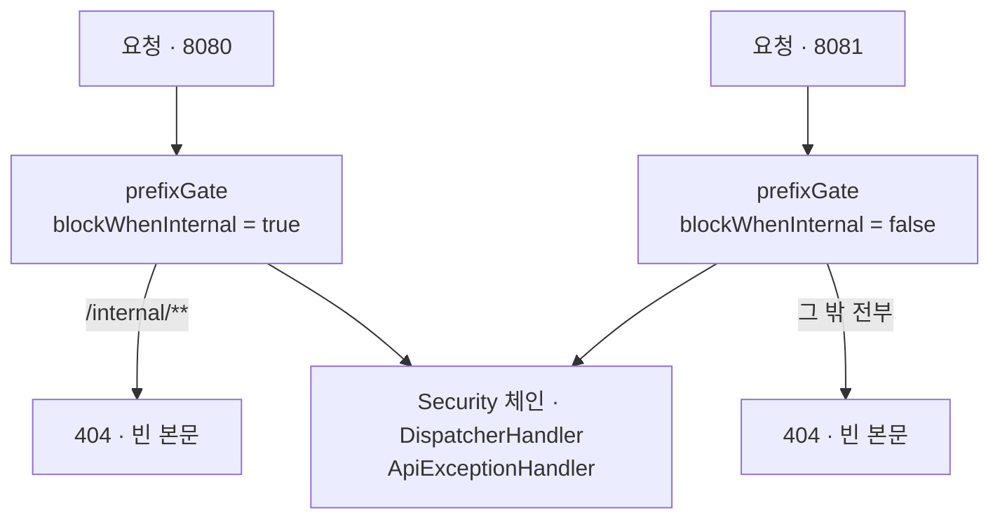

# ADR 0001 — `/internal` 을 별도 포트와 두 번째 `HttpHandler` 체인으로 연다

- 상태: 확정 (ARTEL-266)
- 근거: `config/InternalApiConfig.kt`, `config/InternalApiServer.kt`,
  [`.plan/general/2026-08-06-serve-internal-api-on-separate-port.md`](../../.plan/general/2026-08-06-serve-internal-api-on-separate-port.md),
  [`docs/deployment.md`](../deployment.md)

## 결정

- 무인증 서버-투-서버 경로 `/internal/**` 을 공개 포트에서 빼고 두 번째 포트에만 올립니다.
- 두 번째 reactor-netty `HttpServer` 를 띄우되 `ApplicationContext` 는 하나만 씁니다.
- 체인 둘의 차이는 맨 앞에 끼우는 게이트 필터 하나뿐입니다.

| 포트 | 설정 | 무엇이 뜨나 |
| --- | --- | --- |
| 8080 | `SERVER_PORT` | `/api/**`, `/oauth2/**`, `/login/oauth2/**`, `/ws/**`, Swagger |
| 8081 | `artel.internal-api.port` | `/internal/**` 만 |

- 요청을 검사해서 가르는 것이 아니라 **어느 서버가 그 커넥션을 받았는지**로 갈립니다. 라우팅 결정이
  조립 시점에 고정됩니다.



- 게이트가 Security 보다 앞이라(`add(0, ...)`) 공개 포트의 내부 경로는 **401 이 아니라 404** 입니다.
  - 401 은 "인증만 하면 있다" 는 사실을 흘리지만 404 는 아무것도 흘리지 않습니다.
  - 게이트 뒤는 두 체인이 그대로 공유합니다. 나중에 누가 `WebFilter` 빈을 더해도 두 포트에 똑같이 걸립니다.
- 404 본문은 비어 있습니다. `.agents/docs/error-handling.md` 의 "타입 예외를 던진다" 규약에서 벗어나는
  자리인데, `ApiExceptionHandler` 가 `@RestControllerAdvice` 라 `DispatcherHandler` 안에서만 돌기
  때문입니다. `WebFilter` 에서 던진 예외는 거기 닿지 못하고 500 이 됩니다.

## 왜

- WebFlux 에는 서블릿 스택의 `management.server.port` 에 해당하는 것이 없습니다.
  - reactor-netty 의 `HttpServer` 하나는 소켓 하나만 바인딩합니다.
  - **두 번째 포트를 열려면 두 번째 서버가 반드시 필요합니다.** "단일 서버 유지 + 필터" 는 애초에 성립하지
    않고, 실제 선택지는 "두 서버가 요청을 어떻게 가르느냐" 뿐이었습니다.
- 이 결정 전까지 `/internal/` 을 막는 것은 리버스 프록시 설정이었습니다. 저장소 밖에 있고 리뷰되지 않는
  규칙입니다.
- 8080 에 그 경로가 아예 없으면 공개 호스트 설정을 잘못 만져도 노출될 수 없습니다.

`prefixGate` 는 구현 하나를 두 체인이 **통과와 차단을 뒤집어** 씁니다.

```kotlin
internal fun prefixGate(blockWhenInternal: Boolean): WebFilter = WebFilter { exchange, chain ->
    val internal = INTERNAL_API_PATTERN.matches(exchange.request.path.pathWithinApplication())
    if (internal == blockWhenInternal) notFound(exchange) else chain.filter(exchange)
}
```

- 따로 쓰면 한쪽만 고쳐져 둘이 어긋납니다.
- **이 필터를 `@Bean` 이나 `@Component` 로 만들면 안 됩니다.** 빈이 되는 순간
  `WebHttpHandlerBuilder.applicationContext` 가 두 체인 모두에 넣어 서로를 무력화합니다 — 공개 게이트가
  내부 체인에 들어가면 내부 포트가 자기 경로를 404 로 막습니다.
- 접두사 비교에 `startsWith` 를 쓰지 않는 이유는 `/internalfoo` 가 내부로 오인되기 때문입니다.
  `PathPattern` 은 경로를 세그먼트 단위로 끊습니다.
- `SecurityConfig` 의 permitAll 목록도 같은 문자열을 같은 파서로 읽으므로 두 곳의 의미가 갈리지 않습니다.

## 거절한 대안

| 대안 | 왜 거절했나 |
| --- | --- |
| 별도 `HttpServer` + 부모-자식 `ApplicationContext` | 자식이 자기 빈 그래프를 가져 R2DBC 커넥션 풀·Redis·S3 클라이언트가 두 벌이 되거나, 부모에서 끌어오는 wiring 을 손으로 짜야 함. 컨트롤러 네 개를 위한 대가로 과함 |
| 단일 핸들러 체인 + 요청의 로컬 포트를 보는 `WebFilter` | 필터를 지우는 diff 가 아무것도 깨뜨리지 않은 것처럼 보이고, `localAddress` 가 null 인 경로가 있음 |
| 컨테이너·프록시 레벨에서만 차단 | 이 결정이 없애려는 바로 그 의존 |
| 내부 경로에 공유 시크릿 헤더나 mTLS | `app-net` 안을 신뢰하는 현재 전제를 그대로 둠 |

- Boot 는 actuator 의 별도 포트를 부모-자식 컨텍스트로 구현합니다. 격리는 가장 강하지만 이 저장소가 치를
  값이 아니었습니다.
- 로컬 포트를 읽는 방식은 `@AutoConfigureWebTestClient` 로 컨텍스트에 바인딩한 요청에 실제 소켓이 없어
  `localAddress` 가 null 입니다.
  - 그러면 "모르면 통과"(조용히 열림)와 "모르면 차단"(멀쩡한 테스트가 전부 빨감) 중 하나를 골라야 합니다.
  - 채택한 방식에서는 그 선택 자체가 생기지 않습니다. 포트 번호를 읽는 코드가 없습니다.

## 대가

| 대가 | 무엇이 일어나나 |
| --- | --- |
| 게이트 필터 둘은 여전히 코드임 | 지우면 경계가 무너짐 |
| 공개 게이트를 지우면 8080 이 `/internal/**` 을 다시 엶 | 유일한 실질 회귀 경로. 실제 소켓을 쓰는 통합 테스트가 이 한 가지를 고정함 |
| 내부 게이트를 지우면 내부 포트가 `/api/**` 까지 엶 | 외부에 뜨지 않으므로 실제 피해는 없음 |
| `WebHttpHandlerBuilderCustomizer` 가 널리 쓰이는 API 가 아님 | Boot 3.3.1 의 `HttpHandlerAutoConfiguration` 이 `build()` 직전에 적용한다는 근거를 주석으로 남김 |
| 두 번째 서버의 수명을 손으로 맞춰야 함 | Boot 의 웹 서버와 같은 phase 에 두고, `destroy()` 로도 닫음 |

- **실질적인 외부 차단 근거는 코드가 아니라 배포 토폴로지입니다.** `Jenkinsfile` 의 `docker run` 에 `-p` 가
  없고 컨테이너는 `app-net` 에만 붙습니다. 코드의 포트 분리는 그 토폴로지를 리뷰 가능한 형태로 새기는 것이고,
  실제 차단은 "`-p` 를 추가하지 않는다" 가 맡습니다.
- 내부 서버는 `0.0.0.0` 에 바인딩합니다. `app-net` 의 다른 컨테이너가 닿아야 하기 때문입니다.
- 컨텍스트 기동이 도중에 실패하면 `refresh()` 가 `destroyBeans()` 로 가고 그 경로는 `Lifecycle.stop()` 을
  부르지 않습니다. `DisposableBean.destroy()` 로도 닫지 않으면 이미 열린 소켓이 JVM 이 죽을 때까지 남고,
  컨텍스트를 여럿 띄우는 테스트 suite 에서 포트 고갈로 나타납니다.
- `@ConditionalOnWebApplication(REACTIVE)` 이 없으면 `webEnvironment = NONE` 인 테스트 12 종이 통째로
  죽습니다. NONE 컨텍스트에는 `webHandler` 빈이 없습니다.
- 배포 절차와 검증 명령은 [`docs/deployment.md`](../deployment.md) 의 「Ports」 에 있습니다.
