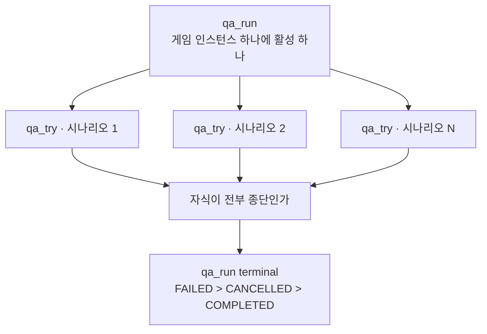

# Architecture

- `artel-orchestration-server` 가 무엇으로 갈라져 있고 왜 그렇게 갈라졌는지
- 클래스 목록과 파일 트리는 여기 없음
- 결정의 이유는 [`docs/adr/`](adr/README.md), 그 밖의 이유는 [`.plan/general/`](../.plan/general/)
- 네 참여자와 그 사이의 화살표는 [`README.md`](../README.md)

## vertical slice 로 자른다

- 도메인 패키지 18 개가 각각 자기 `controller`·`service`·`repository`·`entity`·`dto` 를 소유함
- 계층으로 자르지 않음 — `controller/` 아래 전 도메인의 컨트롤러가 모이는 배치가 아님
- 공유하라고 만든 자리는 둘임

| 패키지 | 무엇이 들어 있나 | 바깥에서 import 하는 파일 |
| --- | --- | --- |
| `common/` | 오류 타입, embedding 큐와 backfill worker, xlsx 쓰기 | 70 |
| `config/` | 두 번째 포트, R2DBC, OpenAPI, 전역 예외 핸들러 | 0 |

- `config/` 를 아무도 import 하지 않는 것이 정상임. 전부 `@Configuration` 이라 component scan 이 엮음
- **`auth` 는 의도하지 않은 세 번째 공유 자리임.** 바깥 48 개 파일이 `CurrentUserId`,
  `SessionUserResolver`, `AuthProperties` 를 가져다 씀 — `common` 의 70 에 가까운 수임
  - `auth` 는 `app_user` 와 `cli_token` 을 소유한 도메인이면서 동시에 전 도메인의 인증 기본기임
  - 그 둘이 한 패키지에 있다는 사실이 이 구조에서 유일하게 어긋난 자리임
- 한 도메인을 읽으려면 디렉터리 하나만 열면 되고, 지우려면 디렉터리 하나만 지우면 됨
- 대신 도메인 사이의 호출이 service 를 직접 부르는 모양으로 나타남. 그 경계를 얇게 두는 것이
  `.agents/docs/coding-style.md` 의 일임
- 크기가 고름과는 거리가 멀음 — `contentmap` 87 개, `knowledge` 49, `testscenario` 48, `scenecontext` 4

## 포트 둘

| 포트 | 무엇 | 누가 |
| --- | --- | --- |
| 8080 | `/api/**`, `/oauth2/**`, `/ws/**`, Swagger | 브라우저와 SDK |
| 8081 | `/internal/**` 만 | `app-net` 안의 agent-server |

- 같은 `ApplicationContext` 에서 `HttpHandler` 체인을 둘 조립하고, 어느 서버가 커넥션을 받았는지로 가름
- 8080 의 `/internal/**` 은 401 이 아니라 404 임
- 결정과 거절한 대안은 [ADR 0001](adr/0001-internal-port.md), 배포 쪽 근거는
  [`deployment.md`](deployment.md)

## WebSocket 은 인바운드 둘, 아웃바운드 둘

| 방향 | 경로 | 무엇이 흐르나 |
| --- | --- | --- |
| 인바운드 | `/ws/sdk` | action 과 그 결과, `pulse`, `GAME_STATE`, WebRTC signalling |
| 인바운드 | `/ws/viewer` | 스트리밍 lease 갱신과 signalling |
| 아웃바운드 | agent-server `/sessions/{id}` | 시나리오 저작 대화 |
| 아웃바운드 | agent-server `/qa-sessions/{id}` | QA 런 봉투 |

- 인바운드 둘은 `HandlerMapping` 하나에 함께 들어 있음. 매핑 빈을 나누면 같은 순위의 `HandlerMapping` 이
  둘이 되어 조회 순서가 등록 순서에 달림
- 프레임 상한 256 KB 를 둘이 나눠 씀 — [ADR 0006](adr/0006-websocket-frame-limit.md)
- `/ws/sdk` 는 Security 체인을 타지 않음. 자격증명이 헤더가 아니라 쿼리에 실려 핸들러가 직접 검증함
- 아웃바운드 둘은 이 서버가 agent-server 에 먼저 거는 것임. `POST` 로 세션을 열고 그 id 로 소켓을 붙임
- **media 는 어느 소켓도 지나지 않음** — 프로토콜은 [`streaming-protocol.md`](streaming-protocol.md)

## 세 단계 — TestRun → TestScenario → TestCase

- `test_case` 는 기능 하나를 검증하는 재사용 라이브러리임
- `test_scenario` 는 케이스를 의미 있는 순서로 엮은 여정임
- `test_run` 은 시나리오를 묶은 실행 세트임
- 관계의 모양이 두 단계에서 다름

| 관계 | 어떻게 | 왜 |
| --- | --- | --- |
| `test_run` ↔ `test_scenario` | junction `test_run_scenario` | 순서와 역방향 질의가 필요함 |
| `test_scenario` ↔ `test_case` | `payload` JSONB 안 `steps[].caseId` | 스텝이 곧 순서이고 참조는 선택적임 |

- 아래쪽도 처음에는 junction(`test_scenario_case`)이었고 V31 이 지웠음. 무엇을 잃었는지는
  [ADR 0004](adr/0004-scenario-cases-as-json.md)
- 실행은 `qa` 가 맡고 저작은 `testscenario` 가 맡음. 같은 시나리오를 두 패키지가 다른 이유로 읽음

## QA 런의 수명



- 시나리오 하나가 `qa_try` 하나임. 아직 차례가 오지 않은 것은 `PENDING` 이고 그 상태는 부모에 없음
- 자식이 종단될 때마다 형제를 전부 다시 읽고, 전부 끝났을 때만 부모를 닫음
- 부모를 닫지 않으면 재실행 가드가 그 게임 인스턴스를 영구히 잠금 — [ADR 0007](adr/0007-qa-run-rollup.md)
- 런 중에 오가는 봉투의 계약은 [`capability-write-frames.md`](capability-write-frames.md) 와
  [`screen-selector-frames.md`](screen-selector-frames.md)

## content_map 은 게임 빌드의 지도

- SDK 가 컴파일된 게임 코드에서 읽어 올린 `evidence` 문서를 이 서버가 지도로 만듦
- `scene` 과 `capability`, 그리고 `evidence` 출신 컬럼만 담는 1:1 하위 테이블 `capability_evidence`
- 게임 빌드 하나에 지도 하나임 — [ADR 0002](adr/0002-content-map-per-build.md)
- `capability` 의 준비도는 축 셋이고 `status` 는 거기서 유도되는 생성 컬럼임 —
  [ADR 0003](adr/0003-capability-readiness-axes.md)
- QA 런이 지도에 되먹임함. 정적 분석이 믿는 것과 실제로 참인 것이 다르다는 사실이 그 frame 들의 출발점임

## knowledge 와 pgvector

- knowledge 항목은 본문과 벡터, 그리고 항목 사이의 관계 edge 로 이루어짐
- 관계 어휘는 닫혀 있고 `LEADS_TO` 는 쓰기가 얼어 있음 —
  [ADR 0005](adr/0005-knowledge-relations.md)
- graph 순회 깊이는 1 또는 2 만 허용함. 3 이상은 노드 수가 컨텍스트 예산을 넘음
- 검색 벡터는 저장 경로가 아니라 **백그라운드 worker** 가 채움

```text
1. 벡터가 없는 소유 행에 대기 행을 만든다
2. 대기 행을 FOR UPDATE SKIP LOCKED 로 집고 그 자리에서 attempts 를 올린다
3. 도메인이 텍스트를 만든다 (락 밖)
4. 텍스트가 나온 행만 /embed 로 벡터화하고 대기 행을 벡터 행으로 바꾼다
```

- **저장 경로에 동기로 붙이지 않는 이유** — 쓰기가 LLM 호출만큼 느려지고, embedding 이 실패하면 본체
  저장까지 함께 날아감. 떼어 두면 본체는 무조건 저장되고 벡터는 나중에 붙음
- 재시도가 곧 다음 tick 이고, 모델을 갈아 끼운 뒤의 재색인도 같은 worker 가 처리함
- worker 는 도메인 무관하게 하나이고(`common/embedding`), `knowledge` 와 `testcase` 가 각자 인스턴스를
  만들어 씀 (ARTEL-215 가 knowledge worker 에서 골격을 뽑음)
- 기본은 꺼져 있음. agent-server 가 없으면 매 tick 실패만 쌓이기 때문이고, 배포 환경에서 켬
- backfill 모델은 agent-server 의 `embedding_model` 과 반드시 같아야 함. 다르면 worker 가 저장을 거부함
- pgvector 는 Java 의존성이 아니라 Postgres 확장임. `V18` 이 `CREATE EXTENSION vector` 를 돌리므로
  로컬 Postgres 도 pgvector 이미지여야 함

## 코루틴이 Reactor 를 대신한 자리

- 2026-07-29 에 ARTEL-181 이 코드베이스 전체를 옮겼음 (commit `17e6133`)

| 무엇 | 전 | 후 |
| --- | --- | --- |
| service·controller | `Mono`·`Flux` | `suspend`·`Flow` |
| repository | `ReactiveCrudRepository` | `CoroutineCrudRepository` |
| 트랜잭션 | `transactionalOperator` 연산자 | `executeAndAwait` |
| 백그라운드 | `boundedElastic().subscribe()` | `CoroutineScope(SupervisorJob() + IO).launch` |
| 스트리밍 | `Sinks.Many` | `MutableSharedFlow` |
| 숨은 빈 결과 | `Mono.empty()` | nullable `null` → 404 |

- **`Mono`·`Flux` 가 타입으로 남은 파일은 442 개 중 10 개뿐임.** 전부 Spring 이 그 모양을 요구하는 자리임
  — `WebSocketHandler.handle()`, Security 콜백, 두 번째 `HttpHandler` 체인, argument resolver,
  `ViewerSessionRegistry`, S3 저장소
- agent-server 로 거는 WebSocket 클라이언트도 Reactor 로 남음. 코루틴 WS 클라이언트 대체가 없어
  `ReactorNettyWebSocketClient` 를 그대로 쓰고, 수신 콜백 안의 DB 저장만 `mono { }` 로 브리지함
- 예외가 하나 있음 — `ProjectDocument` 등록은 트랜잭션을 쓰지 않음. 버전 충돌 재시도가 트랜잭션 밖에
  있어야 하기 때문임. 트랜잭션 안에서 유니크 위반이 나면 Postgres 가 트랜잭션을 abort 시켜 재시도로
  회복할 수 없음
